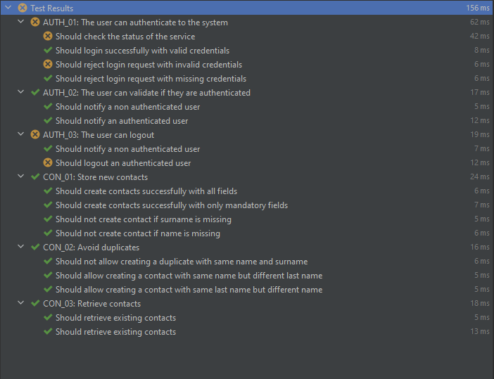

# V1ntra code challenge QA
*Received on Jan 31st 17.01pm*

## Objective
Validate API of a SaaS for an agenda.
Product is exposed on a docker.

## Test Plan
Tests included for each aspect (authentication, usage) folder are specified on their readme.md.

## How to execute

Clone the repository and run the tests inside of the folder test.

On windows, `node node_modules/mocha/bin/mocha test/**/*.Test.js`

On Linux, `./node_modules/mocha/bin/mocha tests/**/*.Test.js`

Alternatively, tests can be ran from any IDE with debugger option, establishing Mocha as the test framework to use.

## Report

A report could have been generated by means of report tools within npm, but I dedicated my time on actually automating.  
This is the report I have obtained from the tests running on Webstorm:

## Framework of choice
Mocha + chai + supertest for sending the requests against the service.

## Portability

The tests could be ported or packed into a docker component to run automatically on a CI, but I did not find time to do so.

## Scenarios Covered

Many further scenarios could have been automated, but not within the given time.
